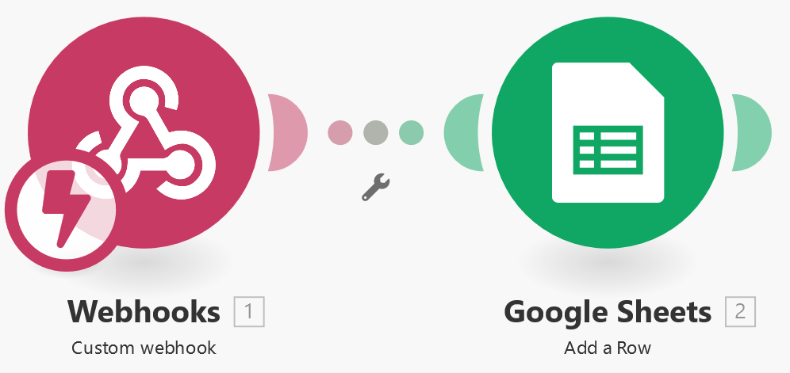
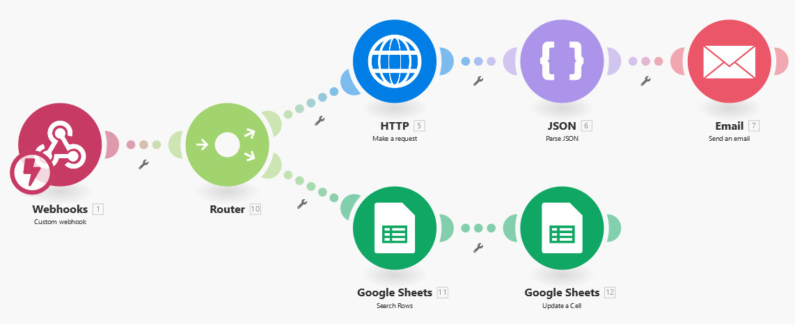

# DigiBP Gempen Incident Management :computer:
```    ___          ___          ___          ___          ___          ___     
     /\  \        /\  \        /\__\        /\  \        /\  \        /\__\    
    /::\  \      /::\  \      /::|  |      /::\  \      /::\  \      /::|  |   
   /:/\:\  \    /:/\:\  \    /:|:|  |     /:/\:\  \    /:/\:\  \    /:|:|  |   
  /:/  \:\  \  /::\~\:\  \  /:/|:|__|__  /::\~\:\  \  /::\~\:\  \  /:/|:|  |__ 
 /:/__/_\:\__\/:/\:\ \:\__\/:/ |::::\__\/:/\:\ \:\__\/:/\:\ \:\__\/:/ |:| /\__\
 \:\  /\ \/__/\:\~\:\ \/__/\/__/~~/:/  /\/__\:\/:/  /\:\~\:\ \/__/\/__|:|/:/  /
  \:\ \:\__\   \:\ \:\__\        /:/  /      \::/  /  \:\ \:\__\      |:/:/  / 
   \:\/:/  /    \:\ \/__/       /:/  /        \/__/    \:\ \/__/      |::/  /  
    \::/  /      \:\__\        /:/  /                   \:\__\        /:/  /   
     \/__/        \/__/        \/__/                     \/__/        \/__/    
```

# License

- [Apache License, Version 2.0](https://github.com/DigiBP/digibp-archetype-camunda-boot/blob/master/LICENSE)

                                                                   

# Authors
* Rafael R.
* Resheka D.
* Roland H.
* Oliver F.
* David M. 

# Quicklinks
Camunda Platform - https://gempen.herokuapp.com 
* Login: helpdeskagent / helpdeskagent

Incident Reporting Form - https://gempen.herokuapp.com/triage.html 
* See “instructions for Testing”

Presentation - https://github.com/DigiBP/digibp-gempen/blob/master/src/main/resources/doc/presentation.pdf


# Summary
As part of the group assignment in Digitalization of Business Processes at FHNW Spring Semester 2019, we designed a smart incident management assistant. This repository contains the workflow which is running on Camunda.
A summary of the business case, as well as the goals of the project, is provided in the following:

Business Case in a nutshell:
* An international business environment with multiple languages spoken
* Centralized helpdesk (only speaking English)
* Helpdesk workload increased massively in the past years 
* A lot of standard problems occur (e.g. „PC is slow“)

Goals:
* Centralize & standardize helpdesk process
* Build standardized user-interface to create incident requests
* Handle multilanguage support
* Take advantage of a chatbot to solve standard request in an automized manner
* Ensure priority support for VIP-employees or urgent requests

For details, see the separate chapters.


# Methodology and Approach
We started the project outlining the corner parts of the whole process. To add complexity, we implemented a chatbot with the ability to translate from different languages to find a solution and give back a possible solution in the user’s language. 
We used the agile approach with weekly sprints.


# Design Approach
We started our journey designing process and decision table using Camunda, we walked through cloud services, deployment tools, and integrations, and we finally ended up on AI and chatbot. 
Some of the gathered knowledge in the semester was used to build the solution presented here; more technical details about each tool utilized can be found below.


# Collaboration
For collaboration, we used different platforms; at first, GitHub version control was used to manage the technical files like processes modeling, decision tables, and data about our integration services.
As indicated on the assignment, to guarantee a flawless integration, we used one instance of Heroku and one GitHub repository.
The integration part is managed on Integromat in different scenarios.

# Process Description (Incident Management)
Our context is the Gempen Company, which replaced the local IT support with an outsourced help desk, which is abroad. These helpdesk agents are English speaking only.
In this new model, Gempen Company trained a few IT analysts to remain on site as VIP support; the VIP support service consists of a small pool of specialists that share the infrastructure. Moreover, monitoring daily activities. They have a high level of English, and politeness, which is needed if they need to talk to high hierarchy level managers in the company. Important to mention is that both outsourced and on-site helpdesk agents inherit the same role on the Incident management process; the only difference is personal or remote assistance.
We developed a smart incident management tool that consists of a chatbot that proposes predefined solutions, classifies the priority according to the info given by the employee, and creation of an incident ticket.


To start a new issue request, you have to fill out the web-form (https://gempen.herokuapp.com/triage.html). Type if you are on site and if the issue is stopping you from working and if it is compliance relevant because the issue is making the company vulnerable.


## Main Phases
The process is divided into three phases:

### Triage Logic
In the first phase, the decision is made if either the user has to use the chatbot or is eligible for VIP support.


### Ticket creation process
In this process the creation of a ticket, either open or closed is described.


If the problem was solved by the chatbot, a closed ticket is created. If it is a VIP or the problem could not be solved by the chatbot, an open ticket is created and an confirmation mail is sent to the user.
a)	VIP or chatbot: If the problem is unresolved, an ‘open’ ticket is automatically created which is added to the list for the helpdesk team. They then call the user back.

b)	Chatbot: If the problem is solved, the user selects [Problem solved], a ‘closed’ ticket is automatically created – To reduce information overload, no e-mail is sent to the customer because he already knows that the issue is resolved.


### Diagnosis and Solving Process
Diagnosis Process (with knowledge base, translation and solving)


In the second phase, the flow is depending on the language the issue reporter is speaking. If it is not English, a translation of the request is done by invoking an external service before sending the request to the support staff. 
After that the knowledge base is consulted before solving the ticket issue.


### Closing Process
The following image shows a comprehensive visualization of our closing process.


## Roles
We have defined two roles in our process; one is the incident reporter, the other the helpdesk agent who solves the issue.

### Incident reporter
The issue is commonly created as incident management. The incident reporter usually is the end-user who has an issue she or he wants to report to the helpdesk staff. The initial process creates a ticket that describes the issue details depending on the hierarchy level. The incident reporter correspondingly gets an e-mail as the feedback on how is the issue is getting proceeded. If the incident reporter needs VIP support, then it is done immediately, or with less hierarchy level leads to the chatbot. Once the issue is solved, the ticket is closed, and the confirmation is sent by email to the incident reported (i.e., end-user).

### Helpdesk Agent
The helpdesk agent plays a major role in our process. Depending on the requester's hierarchy level, the helpdesk agent goes directly to the person. This level of support is reserved for VIPs only. If the issue has an impact on compliance, and it is preventing the requester from work, he or she also gets VIP treatment from the helpdesk agent. The high priority ensures to assist ‘ VIP’ support to resolve the issue in person if the hierarchy level is >=5. The helpdesk agent reacts immediately, especially on a high priority level. All other requests are directed to our chatbot. If the answer to the chatbot is not satisfactory, a ticket is created for the helpdesk agent. Here the helpdesk agent has to call back the requester.


# Architecture
An HTML-Webform has been developed as a standardized user interface for employees to submit incident requests. When a user has filled in his initial information, the process engine is triggered, and the process gets started. After that, either the chatbot or the priority form is shown on the web form user front-end. Local JavaScript code handles the client-side logic as well as the communication with the process engine via REST. To embed the Chatbot in the website, a framework to handle Dialogflow request has been developed.
After the employee has provided the necessary data, and the process has been started, the Camunda process engine uses REST to automize process steps with Integromat as a backend integration layer. Integromat itself makes use of several web services such as Google-Docs and Yandex for on the fly translation of German hotline tickets.


The illustration shows the overall architecture design of our incident management process.


# Subprocesses Description (Technical Details)
We used Google Sheets to store and retrieve data. The data is used in various variables throughout the process.


## Ticket Creation
Creates a row with the incident data in Google Sheets and send an email to the requester in the corresponding language. The text for each language of the confirmation e-mail is stored with variables.


Data structure


As soon an incident is stored in the Google sheets, an e-mail is sent to the person who requested assistance automatically. Dependent on the language of the person, an e-mail template text in the corresponding language is used to fill in the variables like the name. 
This e-mail is then sent to the person as confirmation.


## Get Hierarchy Level
The hierarchy level for each employee is stored in the Google Sheets “employees_db”. There are six hierarchy levels, ranging from none to five, where five is the highest hierarchy level. Hierarchy level five is the top management; they receive VIP support.
Get the hierarchy level from employees database (simulating an intranet platform)


## Decision Table
If the hierarchy level of a person is above 5, the chatbot is circumvented, and the ticket is directly sent to the helpdesk agent who is going personally to the person with the incident. If the person is off-site, the helpdesk agent is calling back within a few minutes. 
This kind of VIP support is only available to the upper management level persons. 
There is only one exception if your hierarchy level 4 and the incident is preventing you from work, and it is compliance relevant; then you also get VIP support to get the request solved as soon as possible.  


## Translate Problem
With this function, we enable users to formulate an issue in German (more languages can be added later). All our helpdesk agents are English speakers. 
Therefore every ticket that is submitted in another language than English must be translated into English first. We use Yandex API to translate the ticket into English to ensure that the helpdesk agent understands the request.


## Solve Ticket
The problem analysis is not a structured process (CMMN). It can include different behaviors of the helpdesk agent. Some are depending on the level of support, others on the language. I.e., if the person is on-site but speaks another language than English, the helpdesk agent must assure that an interpreter can accompany if the problem is severe and onsite intervention is necessary. Alternatively, the helpdesk agent must organize someone in the subsidiary to guarantee onsite support for the VIP.
Also, problem-solving cannot be modeled in BPMN because it is strongly dependent on the actual scenario.


## Create KnowledgeBase entry
We store the suggested solution in a knowledge base. We create a record in Google Sheets, which is called “knowledgebase_db”.




## Close Ticket (English Language)
Once the problem is solved, the ticket is closed. There are two possible ways; either if the customer is satisfied with the solution, the chatbot offered or if the problem was solved by the helpdesk agent. We update the incident data in Google Sheets “incident_db” using webhooks and text. 
We also send a preformatted e-mail to the requester depending on the language selected. If the incident claim was in English, the e-mail is sent right away.


## Close Ticket (German Language)
Once the problem is solved, the ticket is closed. There are two possible ways; either if the customer is satisfied with the solution, the chatbot offered or if the problem was solved by the helpdesk agent. If the incident claim was in German, we translate the accepted solution into English before updating the incident data in Google Sheets “incident_db” using webhooks and text. 
We also send a preformatted e-mail to the requester depending on the language selected.




# Camunda Processes Step by Step Guide

Based on on the business logic during the triage process you either can request help directly as mentioned in earlier chapters or chat with a bot.


## Issue Creation Process (via WebForm)
To report an incident, you fill out the web form https://gempen.herokuapp.com/triage.html.


1.	Click the following URL to open the web form: https://gempen.herokuapp.com/triage.html   
2.	Enter name and e-mail
3.	Select language (default value is ‘English’)
4.	Choose if the issue prevents you from working (default value is ‘No’)
5.	Choose if you are on site or off site (default value is ‘on-site’)
6.	Choose if the issue is compliance relevant (default value is ‘No’)
7.	Submit the request

## Issue Creation Process (via ChatBot)
If you are not a VIP, the chatbot is started to help you with the issue.


1.	Enter the issue in the text field and click the chat button


2.	If the solution which the chatbot suggested was helpful, you could click the button. Yes, my problem is solved; else you click on No, I want to speak to a human. 
After that either the ticket is closed, or the issue is escalated to the human helpdesk agent who contacts the user after a short time.

After every response, the chatbot asks you if you are satisfied with the answer.
### Chatbot Intents
The chatbot can handle the following intents both in english and german:

* pc is slow
* error message
* install new software
* forgott my password


## Helpdesk Agent

Go to http://gempen.herokuapp.com/

Login credentials:
* Username: helpdeskagent
* Password: helpdeskagent

This is the web application for tracking the ticketing process. The Camunda requests the user name and password to monitor the incident processing level. 
The helpdesk agent has a complete version of each ticket, as when occurred, why details. The Task list numbers the open incidents to solve according to the priority and compliance as explained before. Each ticket is labeled with ID, Date Created, Version, priority level, Status. 
The ticket is completed on the priority level red, yellow or green. The red is deployed immediate action, and others are done within some days. The low priority level has a chatbot communication with the user language instantly.  As the Helpdesk Agent is only English speaking the feedback is translated to the user's language and sends to the user email as the ticket is closed. 


1.	Click on Tasklist to open the list of open issue requests


2.	Click on any ticket in the list
3.	After finding the solution enter the solution into the field Solution
4.	If it is a new KB entry, click the box New KB entry
5.	Click the button Complete to close the ticket


# Developer Documentation

## Variables
We used the following set of variables for our process, as shown in the table below. All variables are initialized automatically, so the instantiation of the variables is given each time.


## Technology
The following technologies has been used for implementing the process.

| Technology  | Description |
| ------------- | ------------------ |
|Camunda Modeler  | The Camunda Modeler is used to create BPMN and DMN models. |
|Camunda Platform | Process Engine able to run process in different instances |
|Standard Web Technologies | HTML, CSS and JavaScript is used to create the webfronted and process flow |
|Integromat | Used as service integration to manage the service sided interactions, like Google Sheets and emails. |
|GitHub| Github is used for collaboration and versioning of the programming code as well as the models. |
|Heroku|Heroku is a PaaS (Platform as a Services) which is used to quickly build, run, and operate the Camunda in the cloud. |
|Yandex Translate API|Heroku is a PaaS (Platform as a Services) which is used to quickly build, run, and operate the Camunda in the cloud. |
|Text Editor |Generic text editor |


## Instructions for Testing
With these simple steps, you test the incident management process.
* Open the Gempen Heroku App (https://gempen.herokuapp.com/triage.html)
* We consider that you are an employee of our company and your data is stored in our employee database. Therefore you have to use one of the names according to Table 2, only with these names we can check your hierarchy level.
* Once you write a name from the employee database, the e-mail is automatically filled. If you are a guest in our network, you can fill in your e-mail manually.


The hierarchy level is part of the decision table and changes the severity of the incident. I.e., if the hierarchy level is 5, then the chatbot is circumvented, and the incident is guided directly to the helpdesk staff. All others are directed to the chatbot first.

# Further Enhancements

As mentioned before, our case was developed for an international company with support for English and German speaking employees; we can follow the same structure and tools for developing new languages according to other companies demand.
The current structure also allows us to adapt the service for a more complex IT support hierarchy, with some additional intents on Dialogflow and expanding the decision table these tools can make an even more accurate classification of each request and even can redirect to different queues.

Enjoy


EOF
